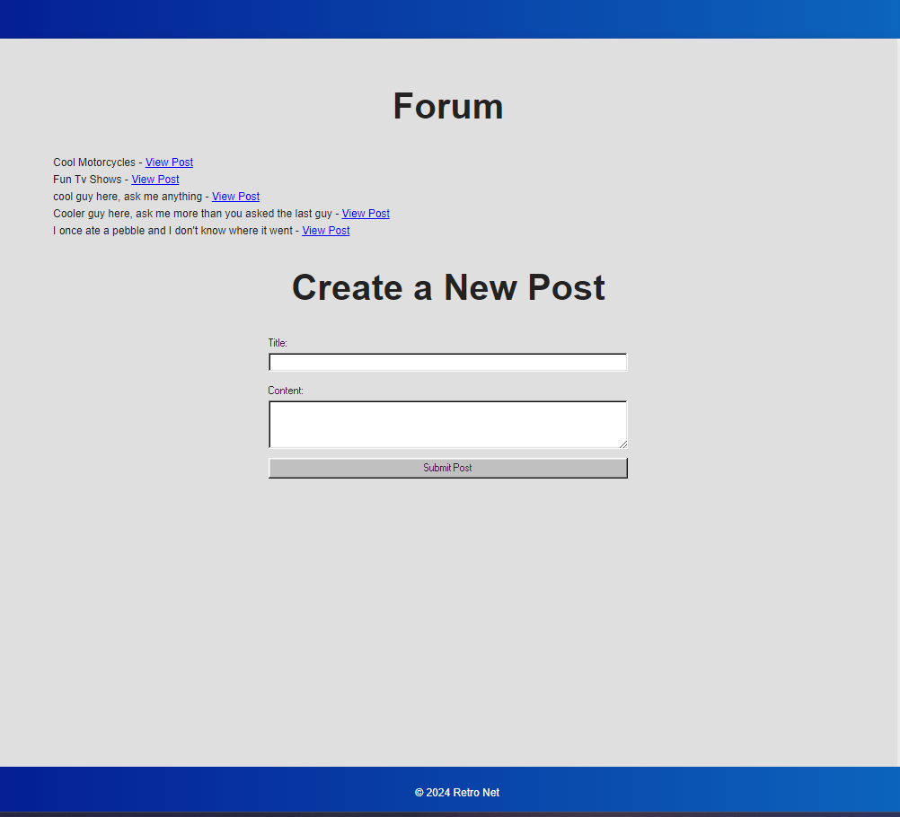

# Retro-Net
MIT License

## Description

Remember the days when the internet was a place of real connection? When conversations were thoughtful, communities were close-knit, and every post felt like it mattered? Retro-Net brings you back to that golden age with a modern twist.

An old school forum for all your nostalgic needs on the Information Super Highway. It takes inspiration from the early days of  message boards from the late 90s and early 2000s. No more doomscrolling TikTok, or Instagram, Retro-Net has everything you'll ever need! Community, weird fonts, and good old-fashioned communication.

## Table of Contents

- [Description](#description)
- [Installation](#installation)
- [License](#license)
- [Usage](#usage)
- [Contribution](#contribution)
- [Questions](#questions)

## Installation

To visit a live deployment, click [here](https://retro-net.onrender.com/)

To run on a local port, clone or download the git repo. 

Once downloaded, create a .env file and input your postgreSQL username, password, as well as a name for your database, referencing the server.js file for variable names. 

Navigate in your terminal to the folder, 'npm i' to install necessary packages, seed the data with 'npm run seed' and start the server on a local port with 'npm start'.

## License

[MIT License](https://opensource.org/license/mit)

## Usage

Create an account and log in to view posts, create new posts, and comment. 

## Contribution
- [treytaylersmith](https://github.com/treytaylersmith)
    * Routes, JS, Models, Backend
- [alstonjohnson](https://github.com/alstonjohnson)
    * Models, Associations, DB
- [bebo1719](https://github.com/bebo1719)
    * Handlebars, Frontend
- [CJ237](https://github.com/CJ237)
    * CSS, Frontend
- [Hublinix](https://github.com/Hublinix)
    * README

## Questions

Email with any additional questions at treytaylersmith@gmail.com

